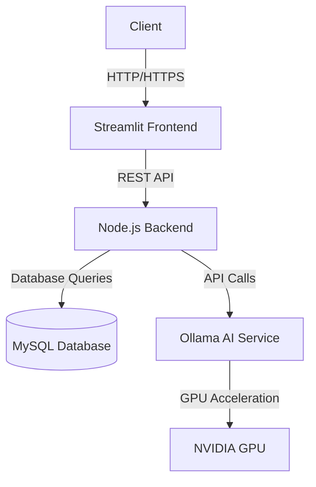

# System Architecture

## High-Level Architecture

## Component Details

### 1. Frontend (Streamlit)
- **Purpose**: User interface for interacting with the application
- **Technologies**: Streamlit, React (if applicable), WebGL for 3D visualization
- **Features**:
  - Interactive 3D garage designer
  - Project management dashboard
  - Real-time cost estimation

### 2. Backend (Node.js)
- **Purpose**: Handle business logic and data processing
- **Technologies**: Node.js, Express.js, Sequelize ORM
- **Key Responsibilities**:
  - API request handling
  - Authentication and authorization
  - Data validation and processing
  - Integration with external services

### 3. Database (MySQL)
- **Purpose**: Persistent data storage
- **Schema**: 
  - Users and authentication
  - Projects and designs
  - Materials and pricing
  - AI model configurations

### 4. AI Service (Ollama)
- **Purpose**: AI-powered features and predictions
- **Features**:
  - Design recommendations
  - Cost optimization
  - Material suggestions

### 5. Infrastructure
- **Containerization**: Docker
- **Orchestration**: Docker Compose
- **GPU Acceleration**: NVIDIA Container Toolkit
- **Networking**: Internal Docker network for inter-service communication
