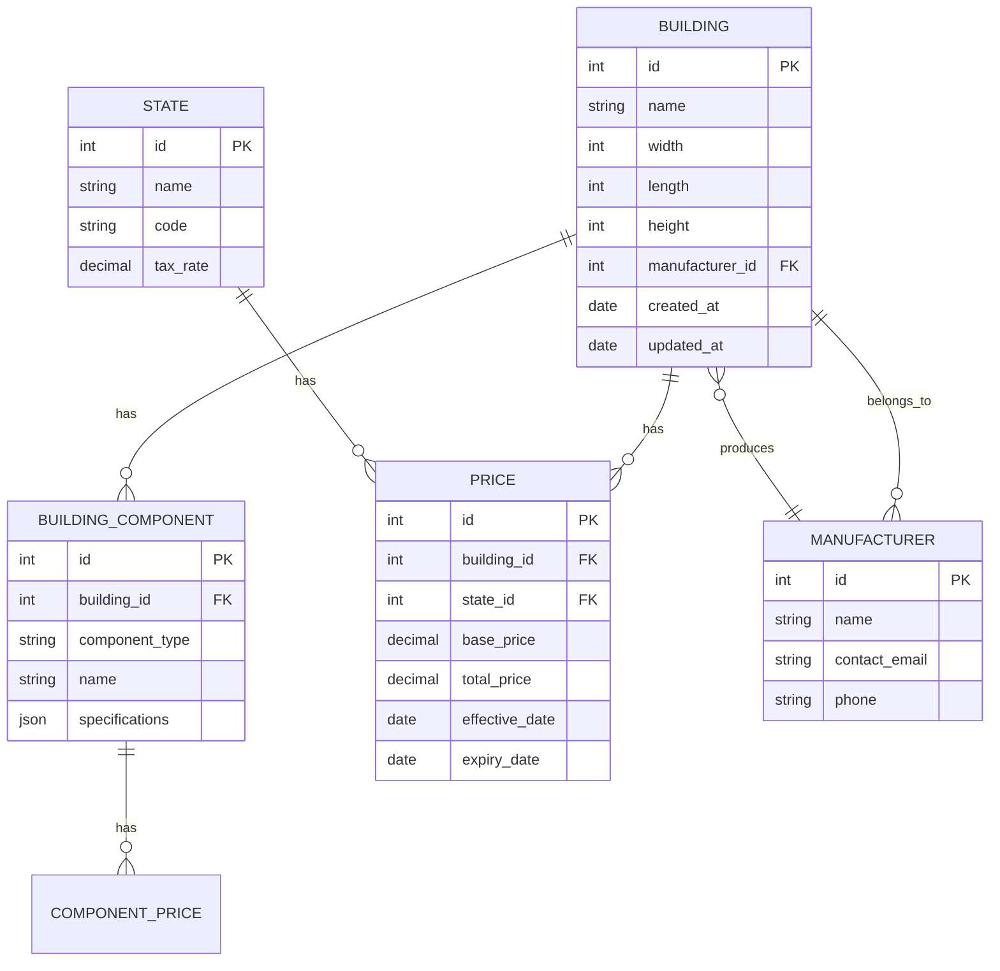

# Database Schema

## Entity Relationship Diagram

## Tables

### Buildings
Stores building configurations and specifications.

| Column | Type | Description |
|--------|------|-------------|
| id | INT | Primary key |
| name | VARCHAR(255) | Building name/identifier |
| width | DECIMAL(10,2) | Building width in feet |
| length | DECIMAL(10,2) | Building length in feet |
| height | DECIMAL(10,2) | Building height in feet |
| manufacturer_id | INT | Reference to manufacturer |
| created_at | TIMESTAMP | Record creation timestamp |
| updated_at | TIMESTAMP | Last update timestamp |

### Building_Components
Stores individual components of each building.

| Column | Type | Description |
|--------|------|-------------|
| id | INT | Primary key |
| building_id | INT | Reference to building |
| component_type | VARCHAR(50) | Type of component |
| name | VARCHAR(255) | Component name |
| specifications | JSON | Component specifications |

### Prices
Stores pricing information for buildings.

| Column | Type | Description |
|--------|------|-------------|
| id | INT | Primary key |
| building_id | INT | Reference to building |
| state_id | INT | Reference to state |
| base_price | DECIMAL(10,2) | Base price |
| total_price | DECIMAL(10,2) | Total price after adjustments |
| effective_date | DATE | When price becomes active |
| expiry_date | DATE | When price expires |

### Manufacturers
Stores manufacturer information.

| Column | Type | Description |
|--------|------|-------------|
| id | INT | Primary key |
| name | VARCHAR(255) | Manufacturer name |
| contact_email | VARCHAR(255) | Contact email |
| phone | VARCHAR(50) | Contact phone |

### States
Stores state/region information for pricing.

| Column | Type | Description |
|--------|------|-------------|
| id | INT | Primary key |
| name | VARCHAR(100) | State name |
| code | VARCHAR(2) | State code |
| tax_rate | DECIMAL(5,2) | Tax rate percentage |

## Stored Procedures

### `getBasicPrice(map_id, gauge)`
Calculates the base price for a building configuration.

**Parameters:**
- `map_id`: Building configuration ID
- `gauge`: Material gauge

### `getSideHeights(map_id, length, height)`
Calculates side wall heights and costs.

**Parameters:**
- `map_id`: Building configuration ID
- `length`: Building length
- `height`: Building height

### `getEachEndClose(map_id, height, width)`
Calculates end wall configurations and costs.

**Parameters:**
- `map_id`: Building configuration ID
- `height`: Building height
- `width`: Building width

## Indexes

| Table | Columns | Type | Description |
|-------|---------|------|-------------|
| BUILDING | id | PRIMARY | Primary key |
| BUILDING | manufacturer_id | INDEX | Foreign key index |
| PRICE | building_id, state_id | COMPOSITE | For price lookups |
| PRICE | effective_date, expiry_date | COMPOSITE | For price validity checks |

## Data Retention
- Building configurations: 5 years
- Price history: 7 years
- User sessions: 30 days
- Audit logs: 1 year
