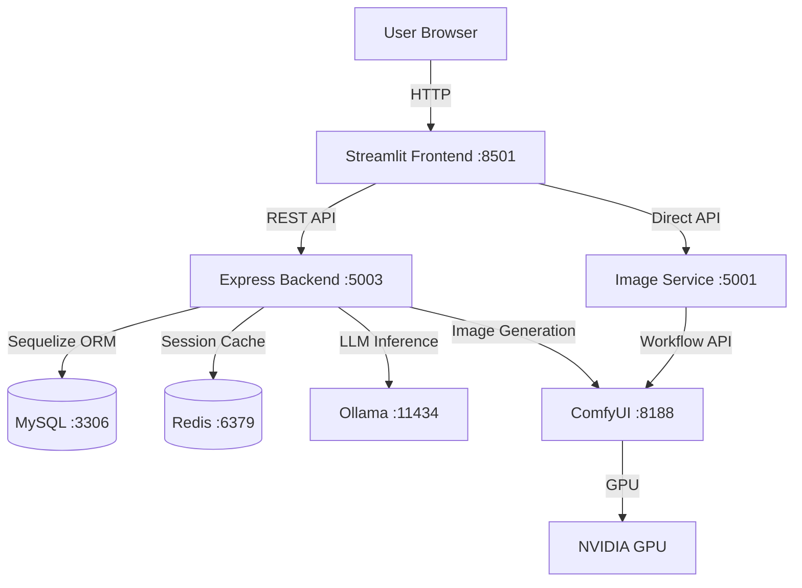

# System Architecture

## High-Level Architecture



## Service Architecture

```
┌─────────────────────────────────────────────────────────────────────┐
│                        Docker Network (garage-network)               │
├─────────────────────────────────────────────────────────────────────┤
│                                                                      │
│  ┌──────────────┐  ┌──────────────┐  ┌──────────────┐              │
│  │  Streamlit   │  │   Backend    │  │   ComfyUI    │              │
│  │   Client     │  │  (Express)   │  │   (SDXL)     │              │
│  │   :8501      │  │   :5003      │  │   :8188      │              │
│  └──────┬───────┘  └──────┬───────┘  └──────┬───────┘              │
│         │                 │                  │                       │
│         │    ┌────────────┴────────────┐    │                       │
│         │    │                         │    │                       │
│         ▼    ▼                         ▼    ▼                       │
│  ┌──────────────┐  ┌──────────────┐  ┌──────────────┐              │
│  │    Ollama    │  │    MySQL     │  │    Redis     │              │
│  │   :11434     │  │    :3306     │  │    :6379     │              │
│  └──────────────┘  └──────────────┘  └──────────────┘              │
│                                                                      │
│  ┌──────────────┐  ┌──────────────┐                                 │
│  │  phpMyAdmin  │  │ Image Service│                                 │
│  │    :8080     │  │    :5001     │                                 │
│  └──────────────┘  └──────────────┘                                 │
│                                                                      │
└─────────────────────────────────────────────────────────────────────┘
```

## Component Details

### 1. Frontend (Streamlit) - Port 8501
- **Purpose**: Chat-based user interface for building configuration
- **Technologies**: Streamlit, Python, httpx
- **Features**:
  - Conversational chat interface
  - Session management per browser tab
  - Image generation page integration
  - Email sharing functionality
- **Container**: `streamlit-client`

### 2. Backend (Express.js) - Port 5003
- **Purpose**: Core business logic and AI agent orchestration
- **Technologies**: Node.js, TypeScript, Express.js, Sequelize
- **Key Components**:
  - **LeadAgent**: Main conversational AI agent
  - **LangGraph Workflow**: State machine for conversation flow
  - **Price Calculation**: Dynamic pricing engine
  - **Parameter Extraction**: NLP-based input parsing
- **Container**: `garage-backend`

### 3. AI Agent System (LangGraph)
- **Purpose**: Orchestrate multi-step conversational workflows
- **Graph Nodes**:
  - `detect_intent` - Classify user intent
  - `detect_building_type` - Identify garage/shed/etc.
  - `extract_parameters` - Parse dimensions, colors, features
  - `check_missing_fields` - Validate required inputs
  - `ask_for_field` - Request missing information
  - `ask_for_color` - Color selection flow
  - `calculate_price` - Compute pricing
  - `show_addons` - Present add-on options
  - `generate_visualization` - Trigger image generation
  - `handle_update` - Process parameter changes
  - `handle_reset` - Reset conversation state

### 4. Database (MySQL) - Port 3306
- **Purpose**: Persistent storage for pricing data and configurations
- **Schema**: 134 Sequelize models including:
  - Building configurations
  - Pricing tables (by state, manufacturer)
  - Add-ons and features
  - Color options
  - Manufacturer data
- **Container**: `mysql`
- **Init Script**: `pricing_engine_pre.sql` (~961MB)

### 5. Cache (Redis) - Port 6379
- **Purpose**: Session storage and caching
- **Container**: `redis`

### 6. LLM Service (Ollama) - Port 11434
- **Purpose**: Local LLM inference for intent detection and NLP
- **Models**: Configurable (llama3, mistral, etc.)
- **Container**: `ollama`

### 7. Image Generation (ComfyUI) - Port 8188
- **Purpose**: AI image generation using Stable Diffusion XL
- **Features**:
  - SDXL model support
  - Custom workflow API
  - GPU acceleration (NVIDIA)
- **Container**: `comfyui`
- **Resources**: 8GB memory limit, 4 CPU cores

### 8. Image Service (FastAPI) - Port 5001
- **Purpose**: Standalone image generation API and web UI
- **Features**:
  - REST API for image generation
  - Web interface for manual generation
  - Gallery of generated images
  - Demo mode (no GPU required)
- **Container**: `garage-image-generator`

### 9. Database Admin (phpMyAdmin) - Port 8080
- **Purpose**: Database management interface
- **Container**: `phpmyadmin`

## Data Flow

### Chat Request Flow
```
1. User sends message via Streamlit UI
2. Streamlit POSTs to /api/v1/chat/ on Backend
3. Backend routes to LeadAgent
4. LeadAgent executes LangGraph workflow:
   a. Detect intent (may call Ollama)
   b. Extract parameters from input
   c. Query MySQL for pricing data
   d. Calculate price
   e. Generate response
5. Response returned to Streamlit
6. UI displays response with pricing/options
```

### Image Generation Flow
```
1. User requests visualization (via chat or direct)
2. Backend/Image Service builds prompt from parameters
3. Prompt sent to ComfyUI API
4. ComfyUI generates image using SDXL
5. Image saved to outputs directory
6. URL returned to client
7. Image displayed in UI
```

## Environment Variables

| Variable | Service | Purpose |
|----------|---------|---------|
| `APP_PORT` | Backend | Express server port |
| `OLLAMA_API_HOST` | Backend | Ollama service URL |
| `COMFYUI_URL` | Backend | ComfyUI service URL |
| `MYSQL_DB_HOST` | Backend | MySQL host |
| `MYSQL_DB` | Backend | Database name |
| `REDIS_HOST` | Backend | Redis host |
| `BACKEND_URL` | Streamlit | Backend API URL |
| `IMAGE_GEN_URL` | Streamlit | Image service URL |

## Network Configuration

All services communicate over the `garage-network` Docker bridge network:
- Internal DNS resolution by container name
- External access via mapped ports
- `host.docker.internal` for host machine access
