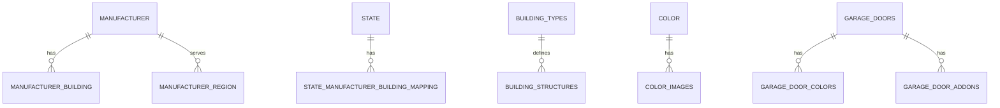

# Database Schema

## Overview

The Garage Builder uses **MySQL 8.0** with **Sequelize ORM**. The database contains **134 models** organized into categories for pricing, building configuration, manufacturers, and system data.

**Database**: `garage`  
**User**: `pricing_engine`  
**Init Script**: `pricing_engine_pre.sql` (~961MB)

## Model Categories

### Core Building Models
| Model | Description |
|-------|-------------|
| `BuildingTypes` | Building type definitions (garage, shed, carport, barn) |
| `BuildingStructures` | Structure configurations |
| `Manufacturer` | Manufacturer information |
| `ManufacturerBuilding` | Manufacturer-building relationships |
| `ManufacturerDefaultBuilding` | Default building configs per manufacturer |
| `State` | US states for regional pricing |
| `StateManufacturerBuildingMapping` | State-manufacturer availability |

### Pricing Models
| Model | Description |
|-------|-------------|
| `BasePrices` | Base pricing data |
| `DataBasePrice` | Price calculation data |
| `DataLegPrice` | Leg/height pricing |
| `DataSidePrice` | Side wall pricing |
| `DataEndPrice` | End wall pricing |
| `DataGableEndPrice` | Gable end pricing |
| `InstallationFees` | Installation fee data |
| `DataInstallationFeesPrice` | Installation pricing |

### Dimension Models
| Model | Description |
|-------|-------------|
| `SideHeights` | Available side heights |
| `SmallerSideHeights` | Smaller height options |
| `EachEndClose` | End closure configurations |
| `SideClosed` | Side closure configurations |
| `LongerBuilding` | Extended length options |

### Component Models
| Model | Description |
|-------|-------------|
| `GarageDoors` | Garage door configurations |
| `GarageDoorFrameout` | Door frameout options |
| `GarageDoorColors` | Door color options |
| `GarageDoorAddons` | Door add-ons |
| `WalkinDoors` | Walk-in door options |
| `Windows` | Window configurations |
| `Canopies` | Canopy options |

### Add-on Models
| Model | Description |
|-------|-------------|
| `Addon` | Add-on definitions |
| `AddonsWidth` | Width-specific add-ons |
| `AdditionalFeatures` | Additional feature options |
| `ExtraAddOn` | Extra add-on items |
| `DataAddOnPrice` | Add-on pricing |
| `DataWidthAddOnPriceCreationAttributes` | Width-based add-on pricing |

### Color Models
| Model | Description |
|-------|-------------|
| `Color` | Color definitions |
| `ColorImages` | Color preview images |
| `PopularColor` | Popular color selections |
| `ColoredScrew` | Colored screw options |
| `DeluxTwoTone` | Two-tone color options |

### Roof Models
| Model | Description |
|-------|-------------|
| `RoofStyles` | Roof style definitions |
| `RoofPitch` | Roof pitch options |
| `DataRoofPitch` | Roof pitch pricing |
| `DataRoofStyles` | Roof style data |
| `Overhang` | Overhang configurations |
| `DataOverhangPrice` | Overhang pricing |

### Structural Models
| Model | Description |
|-------|-------------|
| `Braces` | Brace configurations |
| `CrossBracing` | Cross bracing options |
| `EndCrossBracing` | End cross bracing |
| `TrussName` | Truss naming |
| `TrussUpgrades` | Truss upgrade options |
| `FourFeetCenter` | 4-foot center configurations |
| `FourFeetMapping` | 4-foot mapping data |

### Certificate & Compliance
| Model | Description |
|-------|-------------|
| `Certificate` | Certification data |
| `CertificateLengths` | Certificate length requirements |
| `DataCertificate` | Certificate pricing |
| `DataCertificatePrice` | Certificate cost data |

### System Models
| Model | Description |
|-------|-------------|
| `User` | User accounts |
| `Session` | User sessions |
| `Cache` | Cache storage |
| `CacheLocks` | Cache locking |
| `Job` | Background jobs |
| `JobBatch` | Job batching |
| `FailedJobs` | Failed job tracking |
| `Migration` | Migration tracking |

## Key Relationships



## Database Initialization

The database is initialized from `pricing_engine_pre.sql` which contains:
- Table schemas
- Stored procedures for price calculations
- Seed data for all pricing tables
- State and manufacturer data

### Stored Procedures

| Procedure | Purpose |
|-----------|---------|
| `getBasicPrice(map_id, gauge)` | Calculate base price for configuration |
| `getSideHeights(map_id, length, height)` | Get side wall heights and costs |
| `getEachEndClose(map_id, height, width)` | Calculate end wall configurations |
| `getGarageDoorPrice(...)` | Calculate garage door pricing |
| `getInstallationFee(...)` | Calculate installation fees |

## Migrations & Seeders

Located in `/sequelize/`:

```
sequelize/
├── migrations/           # 134 migration files
│   ├── 20251001151041-create_additional_features.js
│   ├── 20251001151211-create_addon.js
│   └── ... (131 more)
│
└── seeders/              # 124 seeder files
    ├── 20251002062207-seed-additional-features.js
    ├── 20251002062402-seed-addon.js
    └── ... (121 more)
```

### Running Migrations

```bash
# Run all migrations
make run-migrations

# Undo all migrations
make undo-migrations

# Using Sequelize CLI
pnpm sequelize-cli db:migrate
pnpm sequelize-cli db:migrate:undo
```

### Running Seeders

```bash
# Run all seeders
make run-seeders

# Undo all seeders
make undo-seeders

# Using Sequelize CLI
pnpm sequelize-cli db:seed:all
pnpm sequelize-cli db:seed:undo:all
```

## Model Location

All Sequelize models are in:
```
source/config/db/models/
├── AdditionalFeatures.ts
├── Addon.ts
├── AddonsWidth.ts
├── ... (131 more TypeScript model files)
```

## Database Access

### Via Docker
```bash
docker exec -it mysql mysql -u pricing_engine -psecret garage
```

### Via phpMyAdmin
```
URL: http://localhost:8080
User: pricing_engine
Password: secret
```

### Connection Configuration

Environment variables (in docker-compose.yml):
```yaml
MYSQL_DB_HOST: mysql
MYSQL_DB_PORT: 3306
MYSQL_DB: garage
MYSQL_USER: pricing_engine
MYSQL_PASSWORD: secret
```

## Performance Considerations

- **Large Init Script**: ~961MB SQL file for initialization
- **134 Models**: Extensive schema for pricing calculations
- **Indexes**: Key tables have indexes for common queries
- **Connection Pooling**: Managed by Sequelize
