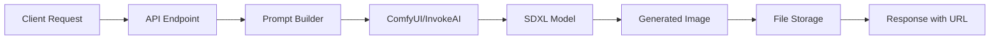

# Image Generation Service

## Overview

The Image Generation Service is a local AI-powered service that creates photorealistic visualizations of garages and sheds based on building parameters. This service runs locally using GPU acceleration and integrates with the main Sensei Estimator platform.

## Architecture

### Technology Stack
- **Framework**: FastAPI (Python) or Express.js (Node.js)
- **Image Generation**: ComfyUI or InvokeAI
- **GPU**: NVIDIA GPU with ≥12GB VRAM (RTX 3090 or better)
- **Model**: Stable Diffusion XL (SDXL) or Flux
- **Storage**: Local filesystem for generated images

### System Flow


## Project Structure

```
garage-image-service/
├── app.py                      # FastAPI application
├── requirements.txt            # Python dependencies
├── config/
│   ├── model.yaml             # Model configuration
│   └── settings.py            # Service settings
├── prompts/
│   ├── template.txt           # Base prompt template
│   ├── garage_template.txt    # Garage-specific template
│   └── shed_template.txt      # Shed-specific template
├── outputs/
│   └── (generated images)     # Image storage
├── services/
│   ├── prompt_builder.py      # Prompt composition logic
│   ├── image_generator.py     # Image generation interface
│   └── storage.py             # File management
├── models/
│   └── request.py             # Request/response models
└── tests/
    └── test_generation.py     # Unit tests
```

## Installation

### Prerequisites
1. **NVIDIA GPU** with ≥12GB VRAM
2. **CUDA Toolkit** 11.8 or later
3. **Python** 3.10+
4. **ComfyUI** or **InvokeAI** installed

### Setup ComfyUI

```bash
# Clone ComfyUI
git clone https://github.com/comfyanonymous/ComfyUI.git
cd ComfyUI

# Install dependencies
pip install -r requirements.txt

# Download SDXL model
cd models/checkpoints
wget https://huggingface.co/stabilityai/stable-diffusion-xl-base-1.0/resolve/main/sd_xl_base_1.0.safetensors

# Start ComfyUI
cd ../..
python main.py --listen 0.0.0.0 --port 8188
```

### Setup Image Generation Service

```bash
# Create project directory
mkdir garage-image-service
cd garage-image-service

# Create virtual environment
python -m venv venv
source venv/bin/activate  # On Windows: venv\Scripts\activate

# Install dependencies
pip install fastapi uvicorn pillow requests pydantic python-multipart aiofiles
```

## Implementation

### 1. FastAPI Application (app.py)

```python
from fastapi import FastAPI, HTTPException
from fastapi.staticfiles import StaticFiles
from fastapi.responses import FileResponse
from pydantic import BaseModel
from datetime import datetime
import os
import json
from services.prompt_builder import PromptBuilder
from services.image_generator import ImageGenerator
from services.storage import StorageService

app = FastAPI(title="Garage Image Generation Service")

# Mount static files
app.mount("/outputs", StaticFiles(directory="outputs"), name="outputs")

# Initialize services
prompt_builder = PromptBuilder()
image_generator = ImageGenerator(comfyui_url="http://localhost:8188")
storage = StorageService(output_dir="outputs")

class GenerateRequest(BaseModel):
    width: float
    length: float
    height: float
    roof_type: str
    color: str = "white"
    building_type: str = "garage"
    location: str = "suburban area"
    style: str = "modern"
    lighting: str = "daylight"
    additional_features: list[str] = []

class GenerateResponse(BaseModel):
    status: str
    file_path: str
    file_url: str
    prompt_used: str
    generation_time: float

@app.post("/generate-image", response_model=GenerateResponse)
async def generate_image(request: GenerateRequest):
    """
    Generate a photorealistic image of a garage or shed based on parameters.
    """
    try:
        start_time = datetime.now()
        
        # Build prompt from parameters
        prompt = prompt_builder.build_prompt(
            building_type=request.building_type,
            width=request.width,
            length=request.length,
            height=request.height,
            roof_type=request.roof_type,
            color=request.color,
            location=request.location,
            style=request.style,
            lighting=request.lighting,
            features=request.additional_features
        )
        
        # Generate image
        image_data = await image_generator.generate(prompt)
        
        # Save image
        timestamp = datetime.now().strftime("%Y%m%d_%H%M%S")
        filename = f"{request.building_type}_{timestamp}.png"
        file_path = storage.save_image(image_data, filename)
        
        # Calculate generation time
        generation_time = (datetime.now() - start_time).total_seconds()
        
        # Save metadata
        metadata = {
            "request": request.dict(),
            "prompt": prompt,
            "filename": filename,
            "generation_time": generation_time,
            "timestamp": timestamp
        }
        storage.save_metadata(metadata, f"{filename}.json")
        
        return GenerateResponse(
            status="success",
            file_path=file_path,
            file_url=f"/outputs/{filename}",
            prompt_used=prompt,
            generation_time=generation_time
        )
        
    except Exception as e:
        raise HTTPException(status_code=500, detail=str(e))

@app.get("/outputs/{filename}")
async def get_image(filename: str):
    """
    Retrieve a generated image by filename.
    """
    file_path = os.path.join("outputs", filename)
    if not os.path.exists(file_path):
        raise HTTPException(status_code=404, detail="Image not found")
    return FileResponse(file_path)

@app.get("/outputs")
async def list_outputs():
    """
    List all generated images.
    """
    files = storage.list_files()
    return {"files": files}

@app.get("/health")
async def health_check():
    """
    Health check endpoint.
    """
    return {"status": "healthy", "service": "image-generation"}

if __name__ == "__main__":
    import uvicorn
    uvicorn.run(app, host="0.0.0.0", port=5001)
```

### 2. Prompt Builder (services/prompt_builder.py)

```python
from typing import List

class PromptBuilder:
    """
    Builds detailed prompts for image generation based on building parameters.
    """
    
    def __init__(self):
        self.base_quality = "photorealistic, high quality, detailed, professional photography"
        self.negative_prompt = "blurry, low quality, distorted, cartoon, sketch, unrealistic"
    
    def build_prompt(
        self,
        building_type: str,
        width: float,
        length: float,
        height: float,
        roof_type: str,
        color: str,
        location: str,
        style: str,
        lighting: str,
        features: List[str] = None
    ) -> str:
        """
        Construct a detailed prompt for image generation.
        """
        
        # Dimension description
        size_desc = f"{int(width)}ft x {int(length)}ft"
        
        # Roof type mapping
        roof_descriptions = {
            "gable": "traditional gable roof with peaked ends",
            "hip": "hip roof with slopes on all four sides",
            "gambrel": "gambrel barn-style roof",
            "flat": "modern flat roof design",
            "a-frame": "A-frame peaked roof"
        }
        roof_desc = roof_descriptions.get(roof_type.lower(), roof_type)
        
        # Building type specific details
        if building_type.lower() == "garage":
            structure_desc = f"A {style} {color} {building_type} with {roof_desc}"
            context = "with a driveway leading to the garage door"
        elif building_type.lower() == "shed":
            structure_desc = f"A {style} {color} storage {building_type} with {roof_desc}"
            context = "in a well-maintained backyard setting"
        else:
            structure_desc = f"A {style} {color} {building_type} with {roof_desc}"
            context = f"in a {location}"
        
        # Additional features
        features_desc = ""
        if features:
            features_desc = ", " + ", ".join(features)
        
        # Lighting conditions
        lighting_desc = {
            "daylight": "natural daylight, clear sky, soft shadows",
            "sunset": "golden hour lighting, warm tones, long shadows",
            "overcast": "diffused lighting, cloudy sky, even illumination",
            "morning": "early morning light, fresh atmosphere"
        }.get(lighting.lower(), lighting)
        
        # Compose final prompt
        prompt = f"""
{structure_desc}, {size_desc}, {context}{features_desc}.
{lighting_desc}.
{self.base_quality}.
Architectural visualization, exterior view, 3/4 angle perspective.
Professional real estate photography style.
"""
        
        return prompt.strip()
    
    def get_negative_prompt(self) -> str:
        """
        Return the negative prompt to avoid unwanted elements.
        """
        return self.negative_prompt
```

### 3. Image Generator (services/image_generator.py)

```python
import requests
import base64
from io import BytesIO
from PIL import Image

class ImageGenerator:
    """
    Interface to ComfyUI for image generation.
    """
    
    def __init__(self, comfyui_url: str = "http://localhost:8188"):
        self.comfyui_url = comfyui_url
        self.default_width = 1024
        self.default_height = 768
    
    async def generate(self, prompt: str, width: int = None, height: int = None) -> bytes:
        """
        Generate an image using ComfyUI API.
        """
        width = width or self.default_width
        height = height or self.default_height
        
        # ComfyUI workflow payload
        workflow = {
            "prompt": {
                "3": {
                    "class_type": "KSampler",
                    "inputs": {
                        "seed": -1,
                        "steps": 30,
                        "cfg": 7.5,
                        "sampler_name": "euler",
                        "scheduler": "normal",
                        "denoise": 1,
                        "model": ["4", 0],
                        "positive": ["6", 0],
                        "negative": ["7", 0],
                        "latent_image": ["5", 0]
                    }
                },
                "4": {
                    "class_type": "CheckpointLoaderSimple",
                    "inputs": {
                        "ckpt_name": "sd_xl_base_1.0.safetensors"
                    }
                },
                "5": {
                    "class_type": "EmptyLatentImage",
                    "inputs": {
                        "width": width,
                        "height": height,
                        "batch_size": 1
                    }
                },
                "6": {
                    "class_type": "CLIPTextEncode",
                    "inputs": {
                        "text": prompt,
                        "clip": ["4", 1]
                    }
                },
                "7": {
                    "class_type": "CLIPTextEncode",
                    "inputs": {
                        "text": "blurry, low quality, distorted",
                        "clip": ["4", 1]
                    }
                },
                "8": {
                    "class_type": "VAEDecode",
                    "inputs": {
                        "samples": ["3", 0],
                        "vae": ["4", 2]
                    }
                },
                "9": {
                    "class_type": "SaveImage",
                    "inputs": {
                        "filename_prefix": "garage",
                        "images": ["8", 0]
                    }
                }
            }
        }
        
        # Send request to ComfyUI
        response = requests.post(
            f"{self.comfyui_url}/prompt",
            json=workflow
        )
        
        if response.status_code != 200:
            raise Exception(f"ComfyUI request failed: {response.text}")
        
        # Get the generated image
        result = response.json()
        prompt_id = result["prompt_id"]
        
        # Poll for completion (simplified - in production use websockets)
        import time
        max_wait = 120  # 2 minutes
        waited = 0
        while waited < max_wait:
            history_response = requests.get(f"{self.comfyui_url}/history/{prompt_id}")
            history = history_response.json()
            
            if prompt_id in history and history[prompt_id].get("outputs"):
                # Get the image data
                outputs = history[prompt_id]["outputs"]
                for node_id, node_output in outputs.items():
                    if "images" in node_output:
                        image_info = node_output["images"][0]
                        image_url = f"{self.comfyui_url}/view?filename={image_info['filename']}&subfolder={image_info.get('subfolder', '')}&type={image_info['type']}"
                        
                        image_response = requests.get(image_url)
                        return image_response.content
            
            time.sleep(2)
            waited += 2
        
        raise Exception("Image generation timeout")
```

### 4. Storage Service (services/storage.py)

```python
import os
import json
from datetime import datetime
from typing import List, Dict

class StorageService:
    """
    Manages file storage for generated images and metadata.
    """
    
    def __init__(self, output_dir: str = "outputs"):
        self.output_dir = output_dir
        os.makedirs(output_dir, exist_ok=True)
    
    def save_image(self, image_data: bytes, filename: str) -> str:
        """
        Save image data to file.
        """
        file_path = os.path.join(self.output_dir, filename)
        with open(file_path, 'wb') as f:
            f.write(image_data)
        return file_path
    
    def save_metadata(self, metadata: Dict, filename: str) -> str:
        """
        Save metadata as JSON.
        """
        file_path = os.path.join(self.output_dir, filename)
        with open(file_path, 'w') as f:
            json.dump(metadata, f, indent=2, default=str)
        return file_path
    
    def list_files(self) -> List[Dict]:
        """
        List all generated images with metadata.
        """
        files = []
        for filename in os.listdir(self.output_dir):
            if filename.endswith('.png'):
                file_path = os.path.join(self.output_dir, filename)
                stat = os.stat(file_path)
                
                # Try to load metadata
                metadata_path = file_path + '.json'
                metadata = {}
                if os.path.exists(metadata_path):
                    with open(metadata_path, 'r') as f:
                        metadata = json.load(f)
                
                files.append({
                    "filename": filename,
                    "size": stat.st_size,
                    "created": datetime.fromtimestamp(stat.st_ctime).isoformat(),
                    "url": f"/outputs/{filename}",
                    "metadata": metadata
                })
        
        return sorted(files, key=lambda x: x['created'], reverse=True)
```

## API Reference

### Generate Image

**Endpoint:** `POST /generate-image`

**Request Body:**
```json
{
  "width": 20,
  "length": 20,
  "height": 10,
  "roof_type": "gable",
  "color": "white",
  "building_type": "garage",
  "location": "Texas suburb",
  "style": "modern",
  "lighting": "daylight",
  "additional_features": ["windows", "side door"]
}
```

**Response:**
```json
{
  "status": "success",
  "file_path": "/outputs/garage_20251024_153245.png",
  "file_url": "/outputs/garage_20251024_153245.png",
  "prompt_used": "A modern white garage with traditional gable roof...",
  "generation_time": 15.3
}
```

### Get Image

**Endpoint:** `GET /outputs/{filename}`

**Response:** Image file (PNG)

### List Outputs

**Endpoint:** `GET /outputs`

**Response:**
```json
{
  "files": [
    {
      "filename": "garage_20251024_153245.png",
      "size": 2048576,
      "created": "2025-10-24T15:32:45",
      "url": "/outputs/garage_20251024_153245.png",
      "metadata": {...}
    }
  ]
}
```

## Testing

### Manual Testing with cURL

```bash
# Generate a garage image
curl -X POST http://localhost:5001/generate-image \
  -H "Content-Type: application/json" \
  -d '{
    "width": 20,
    "length": 20,
    "height": 10,
    "roof_type": "gable",
    "color": "white",
    "building_type": "garage"
  }'

# List all generated images
curl http://localhost:5001/outputs

# View a specific image
open http://localhost:5001/outputs/garage_20251024_153245.png
```

### Python Test Script

```python
import requests
import time

def test_image_generation():
    url = "http://localhost:5001/generate-image"
    
    payload = {
        "width": 20,
        "length": 24,
        "height": 10,
        "roof_type": "gable",
        "color": "gray",
        "building_type": "garage",
        "location": "suburban neighborhood",
        "style": "modern",
        "lighting": "daylight"
    }
    
    print("Sending request...")
    start = time.time()
    
    response = requests.post(url, json=payload)
    
    elapsed = time.time() - start
    print(f"Request completed in {elapsed:.2f}s")
    
    if response.status_code == 200:
        result = response.json()
        print(f"Status: {result['status']}")
        print(f"File: {result['file_url']}")
        print(f"Generation time: {result['generation_time']:.2f}s")
        print(f"\nPrompt used:\n{result['prompt_used']}")
    else:
        print(f"Error: {response.status_code}")
        print(response.text)

if __name__ == "__main__":
    test_image_generation()
```

## Integration with Main Application

### 1. Add to Docker Compose

```yaml
image-generator:
  build: ./garage-image-service
  container_name: image-generator
  runtime: nvidia
  environment:
    - NVIDIA_VISIBLE_DEVICES=all
  networks:
    - garage-network
  ports:
    - "5001:5001"
  volumes:
    - ./outputs:/app/outputs
  deploy:
    resources:
      reservations:
        devices:
          - driver: nvidia
            count: 1
            capabilities: [gpu]
```

### 2. Call from Backend

```typescript
// In your Node.js backend
async function generateBuildingImage(buildingParams) {
  const response = await fetch('http://image-generator:5001/generate-image', {
    method: 'POST',
    headers: { 'Content-Type': 'application/json' },
    body: JSON.stringify(buildingParams)
  });
  
  const result = await response.json();
  return result.file_url;
}
```

## Performance Optimization

### 1. Preview Mode
Generate smaller 512x512 previews for faster iteration:

```python
@app.post("/generate-preview")
async def generate_preview(request: GenerateRequest):
    image_data = await image_generator.generate(
        prompt=prompt,
        width=512,
        height=512
    )
    # ... rest of the logic
```

### 2. Caching
Cache generated images based on parameter hash:

```python
import hashlib

def get_cache_key(params: dict) -> str:
    param_str = json.dumps(params, sort_keys=True)
    return hashlib.md5(param_str.encode()).hexdigest()
```

### 3. Queue System
For production, implement a job queue (Celery, RQ):

```python
from celery import Celery

celery = Celery('tasks', broker='redis://localhost:6379')

@celery.task
def generate_image_task(params):
    # Generate image asynchronously
    pass
```

## Troubleshooting

### Common Issues

**GPU Not Detected**
```bash
# Verify NVIDIA runtime
docker run --gpus all nvidia/cuda:11.0-base nvidia-smi
```

**ComfyUI Not Responding**
```bash
# Check ComfyUI logs
cd ComfyUI
python main.py --listen 0.0.0.0 --port 8188
```

**Slow Generation**
- Reduce image resolution
- Use fewer sampling steps
- Check GPU utilization: `nvidia-smi`

## Next Steps

1. **Implement the FastAPI service** using the code above
2. **Test locally** with sample requests
3. **Integrate with conversation flow** (Ollama → Estimator → Image Service)
4. **Add to frontend** to display generated images
5. **Optimize prompts** based on user feedback
